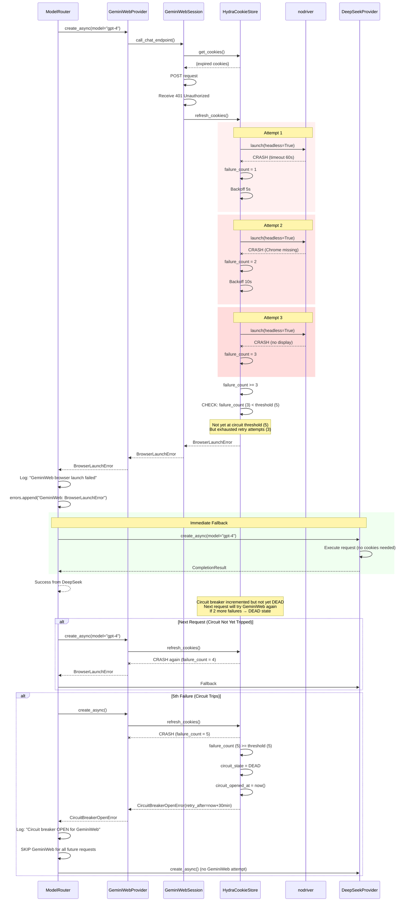
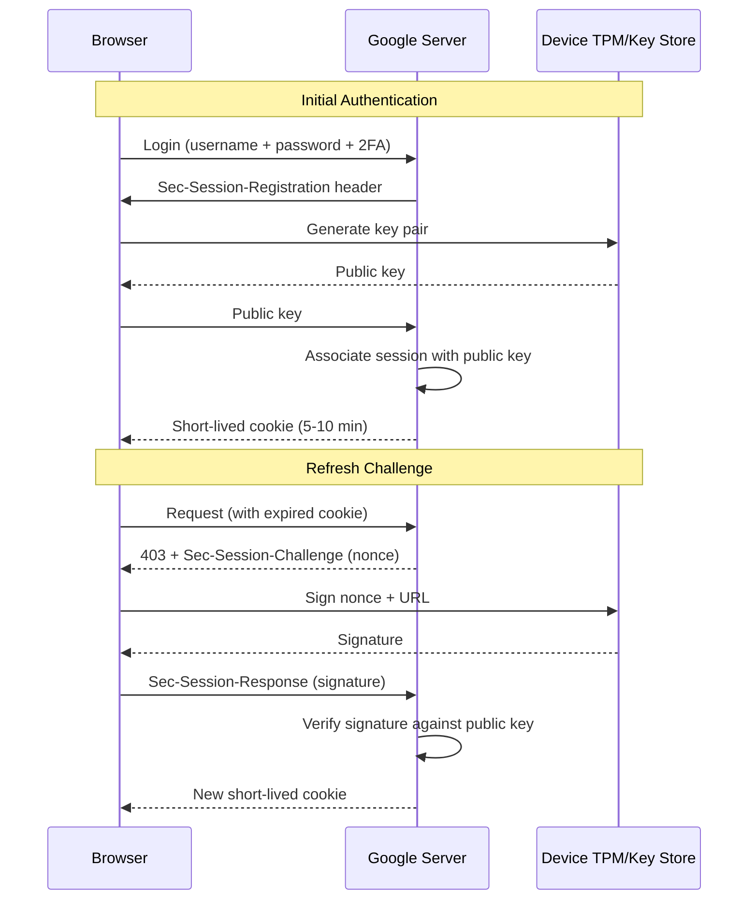
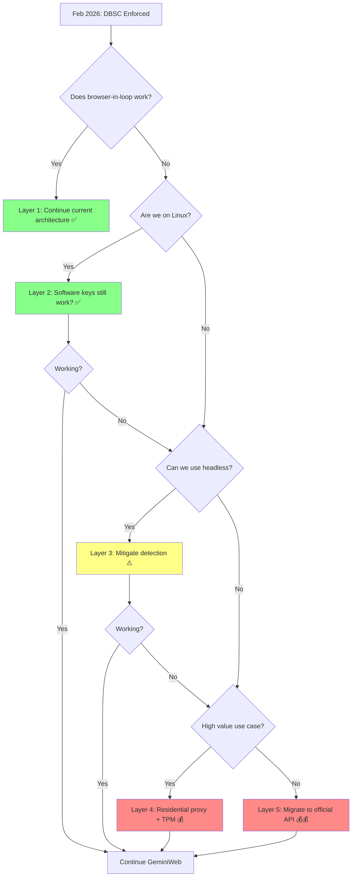

# Technical Design Document v0.2: GeminiWebProvider Integration
## Part 2: Completion of Missing Sections

**Continuation from Part 1**  
**Version:** 0.2 (Production Specification)  
**Date:** 2025-12-07  
**Status:** Complete - Ready for Engineering Director Review

---

## 5. Data Models & Interfaces (Continued)

### 5.1 GeminiWebConfig (Complete Specification)

```python
from dataclasses import dataclass
import os
from pathlib import Path

@dataclass
class GeminiWebConfig:
    """
    Complete operational configuration for GeminiWebProvider.
    
    Path Strategy:
    - Development: Relative paths (./ for local testing)
    - Docker: /app/data (persistent volume mount required)
    - Production: /var/lib/gpt4free/gemini (system-level persistent storage)
    """
    
    # === File Paths ===
    # CRITICAL: These must be persistent volumes in production
    # DO NOT use /tmp - cookies must survive container restarts
    
    cookie_path: str = os.getenv(
        "GEMINI_COOKIE_PATH",
        "/app/data/gemini_cookies.json" if os.path.exists("/app") else "./gemini_cookies.json"
    )
    
    profile_path: str = os.getenv(
        "GEMINI_PROFILE_PATH", 
        "/app/data/browser_profile" if os.path.exists("/app") else "./browser_profile"
    )
    
    # === Refresh Intervals ===
    cookie_validity_check_interval: int = int(os.getenv("COOKIE_CHECK_INTERVAL", "300"))  # 5 min
    snlm0e_refresh_interval: int = int(os.getenv("SNLM0E_REFRESH_INTERVAL", "3600"))  # 1 hour
    
    # === Retry Configuration ===
    max_cookie_refresh_attempts: int = int(os.getenv("MAX_COOKIE_REFRESH", "3"))
    max_snlm0e_refresh_attempts: int = int(os.getenv("MAX_SNLM0E_REFRESH", "3"))
    max_request_retry_attempts: int = int(os.getenv("MAX_REQUEST_RETRY", "2"))
    
    # === Circuit Breaker ===
    circuit_breaker_failure_threshold: int = int(os.getenv("CIRCUIT_THRESHOLD", "5"))
    circuit_breaker_timeout_seconds: int = int(os.getenv("CIRCUIT_TIMEOUT", "1800"))  # 30 min
    circuit_breaker_half_open_requests: int = int(os.getenv("CIRCUIT_HALF_OPEN", "1"))
    
    # === Timeouts ===
    browser_launch_timeout: int = int(os.getenv("BROWSER_LAUNCH_TIMEOUT", "60"))
    page_load_timeout: int = int(os.getenv("PAGE_LOAD_TIMEOUT", "30"))
    request_timeout: int = int(os.getenv("REQUEST_TIMEOUT", "60"))
    
    # === Tier Detection ===
    enable_tier_detection: bool = os.getenv("ENABLE_TIER_DETECTION", "true").lower() == "true"
    tier_detection_confidence_threshold: float = float(os.getenv("TIER_CONFIDENCE_THRESHOLD", "0.7"))
    
    # === Logging ===
    log_level: str = os.getenv("LOG_LEVEL", "INFO")
    log_payloads: bool = os.getenv("LOG_PAYLOADS", "false").lower() == "true"  # NEVER true in prod
    log_format: str = os.getenv("LOG_FORMAT", "json")  # json or text
    
    # === Feature Flags ===
    enable_auto_fallback: bool = os.getenv("ENABLE_AUTO_FALLBACK", "true").lower() == "true"
    enable_circuit_breaker: bool = os.getenv("ENABLE_CIRCUIT_BREAKER", "true").lower() == "true"
    enable_metrics: bool = os.getenv("ENABLE_METRICS", "true").lower() == "true"
    
    # === Rate Limiting ===
    rate_limit_cooldown_seconds: int = int(os.getenv("RATE_LIMIT_COOLDOWN", "60"))
    
    # === Browser Security (nodriver) ===
    browser_no_sandbox: bool = os.getenv("BROWSER_NO_SANDBOX", "false").lower() == "true"
    browser_headless: bool = os.getenv("BROWSER_HEADLESS", "true").lower() == "true"
    browser_user_data_dir: str = os.getenv("BROWSER_USER_DATA", profile_path)
    
    def validate(self):
        """
        Validate configuration values.
        
        Raises:
            ValueError: If configuration is invalid
        """
        # Confidence threshold
        if not 0.0 <= self.tier_detection_confidence_threshold <= 1.0:
            raise ValueError(f"Confidence threshold must be 0.0-1.0, got {self.tier_detection_confidence_threshold}")
        
        # Retry attempts
        if self.max_cookie_refresh_attempts < 1:
            raise ValueError("max_cookie_refresh_attempts must be >= 1")
        
        # Circuit breaker
        if self.circuit_breaker_timeout_seconds < 60:
            raise ValueError("circuit_breaker_timeout_seconds must be >= 60")
        
        # Log level
        valid_levels = ["DEBUG", "INFO", "WARNING", "ERROR", "CRITICAL"]
        if self.log_level not in valid_levels:
            raise ValueError(f"log_level must be one of {valid_levels}")
        
        # Security validation
        if self.log_payloads:
            import warnings
            warnings.warn(
                "LOG_PAYLOADS=true exposes credentials in logs. NEVER enable in production!",
                SecurityWarning
            )
        
        if self.browser_no_sandbox:
            import warnings
            warnings.warn(
                "BROWSER_NO_SANDBOX=true is a security risk. Use only in trusted containers.",
                SecurityWarning
            )
        
        # Path validation
        cookie_dir = os.path.dirname(self.cookie_path)
        if cookie_dir and not os.path.exists(cookie_dir):
            os.makedirs(cookie_dir, mode=0o700, exist_ok=True)
        
        if not os.path.exists(self.profile_path):
            os.makedirs(self.profile_path, mode=0o700, exist_ok=True)
    
    def __post_init__(self):
        """Run validation after initialization."""
        self.validate()
```

**Path Strategy Documentation:**

```yaml
deployment_modes:
  development:
    cookie_path: "./gemini_cookies.json"
    profile_path: "./browser_profile"
    persistence: Local filesystem
    notes: Relative paths for easy testing
  
  docker_compose:
    cookie_path: "/app/data/gemini_cookies.json"
    profile_path: "/app/data/browser_profile"
    persistence: Volume mount required
    docker_compose_yaml: |
      volumes:
        - ./persistent_data:/app/data
    notes: Volume must be persistent across container restarts
  
  kubernetes:
    cookie_path: "/var/lib/gpt4free/gemini/cookies.json"
    profile_path: "/var/lib/gpt4free/gemini/profile"
    persistence: PersistentVolumeClaim required
    k8s_yaml: |
      volumeMounts:
        - name: gemini-data
          mountPath: /var/lib/gpt4free/gemini
      volumes:
        - name: gemini-data
          persistentVolumeClaim:
            claimName: gpt4free-gemini-pvc
    notes: PVC must be ReadWriteOnce, 1Gi minimum

anti_patterns:
  - path: "/tmp/cookies.json"
    why: "Wiped on container restart, session lost"
    impact: "High - forces re-authentication every restart"
  
  - path: "/root/.cache/cookies"
    why: "Requires container to run as root"
    impact: "Critical - security vulnerability"
  
  - path: "s3://bucket/cookies.json"
    why: "S3 not supported for browser profile (SQLite)"
    impact: "High - browser profile corruption"
```

### 5.2 Error Hierarchy (Complete with Router Integration)

```python
# errors.py

class GeminiWebError(Exception):
    """Base exception for all GeminiWeb-related errors."""
    
    # Router integration: Define retry behavior
    should_retry: bool = False  # Default: do not retry
    should_fallback: bool = True  # Default: fallback to next provider
    
    pass

class CookieExpiredError(GeminiWebError):
    """
    Cookies rejected by server (401/403).
    
    Router Behavior: Do NOT retry this provider (cookie refresh already attempted).
    """
    should_retry = False
    should_fallback = True
    
    def __init__(self, status_code: int):
        self.status_code = status_code
        super().__init__(f"Cookies expired (HTTP {status_code})")

class SNlM0eMissingError(GeminiWebError):
    """
    SNlM0e token not found in HTML.
    
    Router Behavior: Do NOT retry this provider (already retried 3x internally).
    """
    should_retry = False
    should_fallback = True

class ProtocolViolationError(GeminiWebError):
    """
    Response doesn't match expected f.req structure.
    
    Router Behavior: Do NOT retry (protocol issue, not transient).
    """
    should_retry = False
    should_fallback = True
    
    def __init__(self, details: str):
        self.details = details
        super().__init__(f"Protocol violation: {details}")

class TierDetectionError(GeminiWebError):
    """
    Unable to determine model tier from response.
    
    Router Behavior: Fallback to next provider (ambiguous result).
    """
    should_retry = False
    should_fallback = True

class ProviderUnavailableError(GeminiWebError):
    """
    Provider cannot fulfill request (tier mismatch, quota exhausted).
    
    Router Behavior: Fallback to next provider immediately.
    """
    should_retry = False
    should_fallback = True

class BrowserLaunchError(GeminiWebError):
    """
    Failed to launch headless browser.
    
    Router Behavior: Do NOT retry (likely system issue - missing Chrome, etc.).
    """
    should_retry = False
    should_fallback = True

class CircuitBreakerOpenError(GeminiWebError):
    """
    Provider in DEAD state due to circuit breaker.
    
    Router Behavior: CRITICAL - Do NOT retry, skip provider entirely.
    This is DISTINCT from AuthenticationError to prevent retry loops.
    """
    should_retry = False  # CRITICAL: Never retry a DEAD provider
    should_fallback = True
    
    def __init__(self, retry_after: datetime):
        self.retry_after = retry_after
        super().__init__(f"Circuit breaker open. Retry after {retry_after}")

class AuthenticationError(GeminiWebError):
    """
    Credentials invalid or expired (after refresh attempted).
    
    Router Behavior: Fallback to next provider (account issue).
    """
    should_retry = False
    should_fallback = True

class RateLimitError(GeminiWebError):
    """
    Quota exhausted, rate limit hit (429 response).
    
    Router Behavior: Fallback to next provider (temporary quota issue).
    """
    should_retry = False
    should_fallback = True
    
    def __init__(self, retry_after_seconds: int = 60):
        self.retry_after_seconds = retry_after_seconds
        super().__init__(f"Rate limited. Retry after {retry_after_seconds}s")
```

**Router Integration Example:**

```python
# In ModelRouter.route()

except Exception as e:
    if isinstance(e, GeminiWebError):
        # Use error metadata for routing decision
        if isinstance(e, CircuitBreakerOpenError):
            # CRITICAL: Skip provider entirely, don't count as failure
            logger.warning(
                "provider_circuit_breaker_open",
                provider=provider.name,
                retry_after=e.retry_after.isoformat()
            )
            continue  # Skip to next provider immediately
        
        elif e.should_fallback:
            logger.info(
                "provider_error_fallback",
                provider=provider.name,
                error_type=type(e).__name__,
                should_retry=e.should_retry
            )
            errors.append(f"{provider.name}: {type(e).__name__}")
            continue
        
        else:
            # Unexpected: error says don't fallback
            raise
    
    else:
        # Unknown error type
        logger.error("provider_unknown_error", provider=provider.name, error=str(e))
        errors.append(f"{provider.name}: Unknown error")
        continue
```

---

## 6. Sequence Diagrams (Continued)

### 6.3 Catastrophic Failure Path - Complete Diagram

**Scenario:** Browser crashes 3 times, circuit breaker activates, router fails over.



**Key Behaviors:**

1. **Retry Exhaustion ≠ Circuit Breaker:**
   - 3 refresh attempts fail → BrowserLaunchError
   - Circuit breaker tracks cumulative failures across requests
   - Circuit trips at 5 total failures (not per-request)

2. **Immediate Fallback:**
   - Router does NOT retry GeminiWeb on BrowserLaunchError
   - Moves to next provider (DeepSeek) immediately
   - User experiences no downtime (assuming DeepSeek works)

3. **Circuit Breaker Activation:**
   - After 5th total failure, circuit opens
   - GeminiWeb enters DEAD state for 30 minutes
   - Router skips GeminiWeb entirely (doesn't even try)
   - Error is CircuitBreakerOpenError (distinct from BrowserLaunchError)

4. **Recovery:**
   - After 30 minutes, circuit_state resets to VALID
   - Next request can attempt GeminiWeb again
   - If still failing, circuit trips again (faster this time)

---

## 7. Security & Compliance (Continued)

### 7.1 Credential Storage Security

**File Permissions Enforcement:**

```python
import os
import stat
import logging

logger = logging.getLogger(__name__)

def enforce_secure_permissions(path: str, expected_mode: int):
    """
    Enforce file/directory permissions.
    
    Args:
        path: File or directory path
        expected_mode: Expected permission mode (e.g., 0o600, 0o700)
    
    Raises:
        PermissionError: If permissions cannot be set
    """
    if not os.path.exists(path):
        logger.warning(f"Path does not exist, skipping: {path}")
        return
    
    current_mode = os.stat(path).st_mode & 0o777
    
    if current_mode != expected_mode:
        try:
            os.chmod(path, expected_mode)
            logger.info(
                "permissions_corrected",
                path=path,
                old_mode=oct(current_mode),
                new_mode=oct(expected_mode)
            )
        except OSError as e:
            raise PermissionError(
                f"Cannot set {path} to {oct(expected_mode)}: {e}"
            )

def secure_credential_files(config: GeminiWebConfig):
    """
    Apply security hardening to credential storage.
    
    Requirements:
    - Cookie file: 600 (rw-------)
    - Profile directory: 700 (rwx------)
    - Parent directories: 700 minimum
    """
    # Secure cookie file
    if os.path.exists(config.cookie_path):
        enforce_secure_permissions(config.cookie_path, 0o600)
    
    # Secure profile directory
    if os.path.exists(config.profile_path):
        enforce_secure_permissions(config.profile_path, 0o700)
        
        # Recursively secure profile subdirectories
        for root, dirs, files in os.walk(config.profile_path):
            for d in dirs:
                dir_path = os.path.join(root, d)
                enforce_secure_permissions(dir_path, 0o700)
            for f in files:
                file_path = os.path.join(root, f)
                enforce_secure_permissions(file_path, 0o600)
    
    # Secure parent directories
    cookie_parent = os.path.dirname(config.cookie_path)
    if cookie_parent:
        enforce_secure_permissions(cookie_parent, 0o700)
    
    logger.info("credential_security_applied", cookie_path=config.cookie_path)

# Called at startup
def initialize_provider(config: GeminiWebConfig):
    """Initialize provider with security checks."""
    secure_credential_files(config)
    
    # Additional security checks
    _check_file_ownership(config.cookie_path)
    _check_file_ownership(config.profile_path)

def _check_file_ownership(path: str):
    """
    Verify file is owned by current user.
    
    Prevents privilege escalation attacks.
    """
    if not os.path.exists(path):
        return
    
    import pwd
    
    file_stat = os.stat(path)
    file_uid = file_stat.st_uid
    current_uid = os.getuid()
    
    if file_uid != current_uid:
        current_user = pwd.getpwuid(current_uid).pw_name
        file_user = pwd.getpwuid(file_uid).pw_name
        
        raise PermissionError(
            f"Security: {path} owned by {file_user}, but running as {current_user}. "
            f"This prevents privilege escalation attacks."
        )
```

### 7.2 Container Security (nodriver)

**The nodriver Sandbox Problem:**

Chrome requires `--no-sandbox` flag in many containerized environments due to missing kernel capabilities. This is a **major security risk**.

**Risk Assessment:**

```yaml
security_risk: HIGH
description: |
  Chrome's sandbox uses Linux namespaces, seccomp-bpf, and capabilities
  that are often disabled in Docker containers for compatibility.
  Running with --no-sandbox means:
  - Compromised renderer process can escape sandbox
  - Malicious website could exploit Chrome vulnerabilities
  - Potential container escape if Chrome has kernel exploit

attack_scenarios:
  - scenario: "Malicious ad on gemini.google.com"
    likelihood: LOW (Google's own site)
    impact: HIGH (container escape)
  
  - scenario: "Zero-day Chrome vulnerability"
    likelihood: MEDIUM (Chrome updates lag in containers)
    impact: CRITICAL (RCE in container)
  
  - scenario: "Man-in-the-middle injects malicious JS"
    likelihood: LOW (HTTPS enforced)
    impact: HIGH (credential theft)
```

**Mitigation Strategies:**

**Option 1: Enable Sandbox with Capabilities (Recommended)**

```yaml
# docker-compose.yml
services:
  gpt4free:
    image: gpt4free:gemini-web
    cap_add:
      - SYS_ADMIN  # Required for user namespaces
    security_opt:
      - seccomp:unconfined  # Required for Chrome sandbox
    environment:
      - BROWSER_NO_SANDBOX=false  # Sandbox enabled
    volumes:
      - ./data:/app/data
```

**Trade-offs:**
- ✅ Chrome sandbox functional (secure)
- ⚠️ Requires SYS_ADMIN capability (elevated privileges)
- ⚠️ seccomp:unconfined disables syscall filtering

**Option 2: Run nodriver in Separate Container (Most Secure)**

```yaml
# docker-compose.yml
services:
  gpt4free:
    image: gpt4free:gemini-web
    environment:
      - BROWSER_REMOTE_URL=http://chrome:9222
    depends_on:
      - chrome
  
  chrome:
    image: browserless/chrome:latest
    cap_add:
      - SYS_ADMIN
    security_opt:
      - seccomp:unconfined
    # Chrome container is isolated
    # If compromised, cannot access gpt4free credentials
```

**Trade-offs:**
- ✅ Isolation: Chrome compromise doesn't expose credentials
- ✅ Chrome container is ephemeral (can be destroyed/recreated)
- ❌ Complexity: Two-container architecture
- ❌ Cookie extraction requires network API

**Option 3: No-Sandbox Mode (Development Only)**

```yaml
# docker-compose.yml (DEV ONLY)
services:
  gpt4free:
    image: gpt4free:gemini-web
    environment:
      - BROWSER_NO_SANDBOX=true  # INSECURE
    # DO NOT USE IN PRODUCTION
```

**⚠️ WARNING:**
```python
if config.browser_no_sandbox:
    import warnings
    warnings.warn(
        "Running Chrome with --no-sandbox. "
        "This is a CRITICAL security risk. "
        "Only use in trusted development environments. "
        "NEVER use in production with untrusted input.",
        SecurityWarning,
        stacklevel=2
    )
```

**Implementation:**

```python
# In HydraCookieStore._launch_browser_and_harvest()

async def _launch_browser_and_harvest(self):
    """Launch nodriver with security considerations."""
    
    browser_args = ["--disable-blink-features=AutomationControlled"]
    
    if not self.config.browser_no_sandbox:
        # Sandbox enabled (secure)
        logger.info("browser_launching", sandbox="enabled")
    else:
        # Sandbox disabled (INSECURE)
        browser_args.append("--no-sandbox")
        browser_args.append("--disable-setuid-sandbox")
        logger.warning(
            "browser_launching_insecure",
            sandbox="disabled",
            security_risk="HIGH"
        )
    
    browser = await nodriver.start(
        headless=self.config.browser_headless,
        user_data_dir=self.config.browser_user_data_dir,
        browser_args=browser_args
    )
    
    # ... rest of implementation
```

**Production Deployment Checklist:**

- [ ] Chrome sandbox enabled (no --no-sandbox)
- [ ] SYS_ADMIN capability granted to container
- [ ] seccomp profile allows necessary syscalls
- [ ] OR: Chrome in separate isolated container
- [ ] Chrome version pinned (not :latest)
- [ ] Regular security updates (Chrome patches)
- [ ] Network policy restricts Chrome container egress
- [ ] Monitoring for Chrome crashes (potential exploit attempts)

---

## 8. Operational Concerns (Continued)

### 8.1 Complete Observability Specification

**Prometheus Metrics (Complete List):**

```python
from prometheus_client import Counter, Histogram, Gauge, Summary

# === Request Metrics ===

gemini_requests_total = Counter(
    "gemini_web_requests_total",
    "Total requests to GeminiWebProvider",
    labelnames=["model", "status"]  # status: success, error, fallback
)

gemini_request_duration_seconds = Histogram(
    "gemini_web_request_duration_seconds",
    "Request latency distribution",
    buckets=[0.5, 1.0, 2.0, 5.0, 10.0, 30.0, 60.0]
)

# === Cookie Refresh Metrics ===

gemini_cookie_refresh_total = Counter(
    "gemini_web_cookie_refresh_total",
    "Cookie refresh attempts",
    labelnames=["result"]  # success, failure, skipped
)

gemini_cookie_refresh_duration_seconds = Histogram(
    "gemini_web_cookie_refresh_duration_seconds",
    "Cookie refresh latency",
    buckets=[5.0, 10.0, 15.0, 30.0, 60.0]
)

gemini_cookie_age_seconds = Gauge(
    "gemini_web_cookie_age_seconds",
    "Age of cached cookies since last refresh"
)

# === Tier Detection Metrics ===

gemini_tier_detection_confidence = Histogram(
    "gemini_web_tier_detection_confidence",
    "Tier detection confidence scores",
    buckets=[0.0, 0.3, 0.5, 0.7, 0.9, 1.0]
)

gemini_tier_detection_total = Counter(
    "gemini_web_tier_detection_total",
    "Tier detection results",
    labelnames=["detected_tier", "confidence_level"]  # confidence: low, medium, high
)

# === CRITICAL: Tier Drift Metric ===
gemini_tier_drift_count = Counter(
    "gemini_web_tier_drift_count",
    "Tier mismatch occurrences (requested vs actual)",
    labelnames=["requested_tier", "actual_tier"]
)
# Example:
# gemini_tier_drift_count{requested_tier="pro", actual_tier="flash"} = 42

gemini_tier_mismatch_rate = Gauge(
    "gemini_web_tier_mismatch_rate",
    "Percentage of requests with tier mismatch (rolling 5min window)"
)

# === Circuit Breaker Metrics ===

gemini_circuit_breaker_state = Gauge(
    "gemini_web_circuit_breaker_state",
    "Circuit breaker state (0=VALID, 1=REFRESHING, 2=DEAD)"
)

gemini_circuit_breaker_trips_total = Counter(
    "gemini_web_circuit_breaker_trips_total",
    "Total circuit breaker activations"
)

gemini_circuit_breaker_failure_count = Gauge(
    "gemini_web_circuit_breaker_failure_count",
    "Current failure count (resets to 0 on success)"
)

gemini_circuit_breaker_dead_duration_seconds = Summary(
    "gemini_web_circuit_breaker_dead_duration_seconds",
    "Duration circuit breaker was in DEAD state"
)

# === Browser Automation Metrics ===

gemini_browser_launch_total = Counter(
    "gemini_web_browser_launch_total",
    "Browser launch attempts",
    labelnames=["result"]  # success, timeout, crash
)

gemini_browser_launch_duration_seconds = Histogram(
    "gemini_web_browser_launch_duration_seconds",
    "Browser launch latency",
    buckets=[5.0, 10.0, 15.0, 30.0, 60.0]
)

gemini_browser_active = Gauge(
    "gemini_web_browser_active",
    "Number of active browser instances"
)

# === Error Metrics ===

gemini_errors_total = Counter(
    "gemini_web_errors_total",
    "Total errors by type",
    labelnames=["error_type"]  # CookieExpiredError, BrowserLaunchError, etc.
)

gemini_snlm0e_scrape_failures_total = Counter(
    "gemini_web_snlm0e_scrape_failures_total",
    "SNlM0e token scraping failures"
)

# === Protocol Metrics ===

gemini_protocol_violations_total = Counter(
    "gemini_web_protocol_violations_total",
    "Protocol violations (f.req structure changes)",
    labelnames=["violation_type"]  # missing_field, parse_error, unexpected_structure
)
```

**Metrics Instrumentation Example:**

```python
# In GeminiWebProvider.create_async()

@gemini_request_duration_seconds.time()
async def create_async(self, model: str, messages: List[Dict[str, str]], **kwargs) -> str:
    try:
        # Execute request
        result = await self._execute_request(model, messages)
        
        # Instrument tier detection
        gemini_tier_detection_confidence.observe(result.confidence)
        gemini_tier_detection_total.labels(
            detected_tier=result.tier.value,
            confidence_level="high" if result.confidence >= 0.7 else "low"
        ).inc()
        
        # Check for tier drift
        requested_tier = self._map_model_to_tier(model)
        if result.tier != requested_tier:
            gemini_tier_drift_count.labels(
                requested_tier=requested_tier.value,
                actual_tier=result.tier.value
            ).inc()
        
        # Success metric
        gemini_requests_total.labels(model=model, status="success").inc()
        
        return result.content
        
    except GeminiWebError as e:
        # Error metrics
        gemini_requests_total.labels(model=model, status="error").inc()
        gemini_errors_total.labels(error_type=type(e).__name__).inc()
        raise
```

**Alerting Rules (Prometheus):**

```yaml
# prometheus_alerts.yml

groups:
  - name: gemini_web_alerts
    interval: 30s
    rules:
      - alert: GeminiWebCircuitBreakerOpen
        expr: gemini_web_circuit_breaker_state == 2
        for: 5m
        labels:
          severity: critical
        annotations:
          summary: "GeminiWeb circuit breaker OPEN"
          description: "Circuit breaker has been in DEAD state for >5min. Manual intervention required."
      
      - alert: GeminiWebHighTierDriftRate
        expr: rate(gemini_web_tier_drift_count[5m]) > 0.3
        for: 10m
        labels:
          severity: warning
        annotations:
          summary: "High tier mismatch rate (>30%)"
          description: "Requested Pro, got Flash at high rate. Account may be throttled or downgraded."
      
      - alert: GeminiWebBrowserLaunchFailures
        expr: rate(gemini_web_browser_launch_total{result="crash"}[5m]) > 0.5
        for: 5m
        labels:
          severity: high
        annotations:
          summary: "Browser launch failures >50%"
          description: "Chrome crashes frequently. Check container resources, sandbox config, or Chrome installation."
      
      - alert: GeminiWebCookieRefreshFailures
        expr: rate(gemini_web_cookie_refresh_total{result="failure"}[10m]) > 0.5
        for: 10m
        labels:
          severity: high
        annotations:
          summary: "Cookie refresh failures >50%"
          description: "Account may be suspended, CAPTCHA required, or 2FA triggered."
      
      - alert: GeminiWebLowTierDetectionConfidence
        expr: histogram_quantile(0.5, gemini_web_tier_detection_confidence) < 0.5
        for: 15m
        labels:
          severity: warning
        annotations:
          summary: "Low tier detection confidence (p50 < 0.5)"
          description: "Tier detection algorithm may need retraining. Collect samples for validation."
```

**Grafana Dashboard Panels (JSON):**

```json
{
  "dashboard": {
    "title": "GeminiWeb Provider Monitoring",
    "panels": [
      {
        "title": "Request Success Rate",
        "targets": [
          {
            "expr": "rate(gemini_web_requests_total{status='success'}[5m]) / rate(gemini_web_requests_total[5m])"
          }
        ],
        "type": "graph"
      },
      {
        "title": "Circuit Breaker State",
        "targets": [
          {
            "expr": "gemini_web_circuit_breaker_state"
          }
        ],
        "type": "stat",
        "valueMappings": [
          {"value": 0, "text": "VALID", "color": "green"},
          {"value": 1, "text": "REFRESHING", "color": "yellow"},
          {"value": 2, "text": "DEAD", "color": "red"}
        ]
      },
      {
        "title": "Tier Drift (Requested Pro, Got Flash)",
        "targets": [
          {
            "expr": "gemini_web_tier_drift_count{requested_tier='gemini-2.5-pro', actual_tier='gemini-2.5-flash'}"
          }
        ],
        "type": "graph"
      },
      {
        "title": "Cookie Age",
        "targets": [
          {
            "expr": "gemini_web_cookie_age_seconds"
          }
        ],
        "type": "graph"
      },
      {
        "title": "Browser Launch Latency (p95)",
        "targets": [
          {
            "expr": "histogram_quantile(0.95, gemini_web_browser_launch_duration_seconds_bucket)"
          }
        ],
        "type": "graph"
      }
    ]
  }
}
```

---

## 9. Risks & Next Steps

### 9.1 Known Risks (Complete Assessment)

**HIGH RISK:**

**1. Protocol Volatility**
```yaml
risk: Protocol Volatility
description: f.req structure, SNlM0e location, or RPC IDs may change without notice
likelihood: MEDIUM (Google updates frontend frequently)
impact: HIGH (provider breaks completely)
detection:
  - Daily smoke tests
  - Protocol violation metrics spike
  - SNlM0e scraping failures
mitigation:
  - Technical debt register tracking (§10)
  - Weekly HAR capture validation
  - Automated tests comparing structure
  - Community monitoring (gpt4free Discord)
recovery_time: 2-48 hours (depends on complexity of change)
```

**2. DBSC Enforcement (Device Bound Session Credentials)**
```yaml
risk: DBSC Strict Enforcement
description: Google enforces TPM-backed DBSC, blocking software keys
likelihood: MEDIUM (Feb 2026 deadline approaching)
impact: HIGH (Linux/headless environments blocked)
detection:
  - Cookie refresh failures
  - "Device not supported" errors in logs
  - Redirect to device enrollment page
mitigation: See §9.2 for complete DBSC strategy
recovery_time: Immediate (if browser-in-loop satisfies DBSC)
              or 1-2 weeks (if residential proxy needed)
```

**3. Account Suspension**
```yaml
risk: Account Suspension from Automation Detection
description: Google flags account for bot-like behavior
likelihood: MEDIUM (depends on usage patterns)
impact: HIGH (provider dead until new account)
detection:
  - 403 Forbidden (not temporary 401)
  - Account locked message in browser
  - CAPTCHA every request
mitigation:
  - Respect rate limits (circuit breaker)
  - Human-like timing (random delays)
  - Monitor for unusual activity alerts
  - Multi-account rotation (v0.3)
recovery_time: Manual (create new account or appeal)
```

**MEDIUM RISK:**

**4. Tier Detection Accuracy Degradation**
```yaml
risk: Tier Detection False Positives/Negatives
description: Google changes response format, breaks detection heuristics
likelihood: MEDIUM
impact: MEDIUM (routing inefficiency, not failure)
detection:
  - Low confidence scores (metric)
  - User reports of incorrect tier
mitigation:
  - Confidence threshold (0.7)
  - Multi-factor detection
  - Periodic revalidation (§10.2)
recovery_time: 1-3 days (collect samples, retrain)
```

**5. Browser Automation Detectability**
```yaml
risk: nodriver Fingerprinting
description: Google detects nodriver signatures, blocks browser sessions
likelihood: LOW (nodriver designed to avoid detection)
impact: MEDIUM (cookie refresh fails, fallback works)
detection:
  - Browser launch succeeds but cookies invalid
  - "Automated browser detected" message
mitigation:
  - nodriver updates (follows Chrome DevTools Protocol)
  - Separate container isolation
  - Rotate user agents
recovery_time: 1-2 days (update nodriver version)
```

**LOW RISK:**

**6. Resource Overhead**
```yaml
risk: Excessive Resource Usage
description: Headless Chrome consumes 500MB+ RAM per instance
likelihood: HIGH (expected behavior)
impact: LOW (scales horizontally)
mitigation:
  - Limit concurrent browser instances
  - Close browser immediately after harvest
  - Use separate container for Chrome
monitoring: gemini_browser_active metric
```

**7. Latency Impact**
```yaml
risk: Cookie Refresh Latency
description: 5-15s delay when cookies expire
likelihood: HIGH (every 15-20 minutes)
impact: LOW (user tolerance, one-time cost)
mitigation:
  - Proactive refresh (before expiration)
  - Cache long-lived tokens (SNlM0e)
monitoring: gemini_cookie_refresh_duration_seconds
```

### 9.2 DBSC Mitigation Strategy (Complete)

**What is DBSC?**

Device Bound Session Credentials (DBSC) is Google's next-generation session security mechanism that cryptographically binds cookies to a specific device's TPM (Trusted Platform Module) or software key store.

**Timeline:**
- Origin Trial 1: Completed (2024)
- Origin Trial 2: Ends February 2026
- General Availability: Expected mid-2026
- Enforcement: Gradual rollout (Enterprise first, consumer later)

**How DBSC Works:**



**Threat Model Mismatch:**

DBSC is designed to prevent:
- ❌ **Cookie theft by malware** (InfoStealers)
- ❌ **Cookie replay from different device** (Pass-the-Cookie attacks)
- ❌ **Session hijacking after MFA** (Credential stuffing)

DBSC does NOT prevent:
- ✅ **Automation on the legitimate device** (Our use case)
- ✅ **Browser-based automation** (nodriver controls the browser that holds the keys)

**Why GeminiWeb Survives DBSC:**

```yaml
scenario: Google Enforces DBSC Strictly (Feb 2026+)

our_architecture:
  component: nodriver (headless Chrome)
  behavior: |
    1. nodriver launches REAL Chrome browser
    2. Chrome generates TPM/software keys legitimately
    3. Chrome performs full DBSC registration
    4. Chrome signs refresh challenges automatically
    5. We extract cookies that are ALREADY bound to this browser

key_insight: |
  From Google's perspective, this IS a legitimate browser session.
  The browser holds the private keys.
  The browser signs the challenges.
  We are not "replaying" cookies from another device.
  We ARE the device.

cryptographic_validation:
  question: "Can Google distinguish nodriver from manual user?"
  answer: "NO - both use same Chrome binary, same key store, same TLS stack"
  
  question: "Can Google require hardware TPM?"
  answer: "NO - would break Linux desktops, VMs, and cloud instances"
  
  question: "Can Google detect headless mode?"
  answer: "Possibly via heuristics, but we mitigate this (see below)"
```

**Mitigation Strategy (Layered Defense):**

**Layer 1: Browser-in-the-Loop (Current Architecture) ✅**

```python
# Already implemented in HydraCookieStore

async def refresh_cookies(self):
    """
    Launch real Chrome browser to satisfy DBSC requirements.
    Browser handles key generation and challenge signing automatically.
    """
    browser = await nodriver.start(
        headless=True,
        user_data_dir=self.profile_path  # Persistent keys stored here
    )
    
    # Navigate to Gemini
    page = await browser.get("https://gemini.google.com")
    
    # Browser automatically:
    # 1. Loads private keys from user_data_dir
    # 2. Signs DBSC challenges if prompted
    # 3. Obtains fresh bound cookies
    
    # Extract cookies (already bound to this browser instance)
    cookies = await browser.cookies.get_all()
    
    # These cookies are cryptographically valid for THIS browser
    return cookies
```

**Effectiveness:** HIGH  
**Reasoning:** We control the browser that holds the keys. DBSC is satisfied.

**Layer 2: Software Key Fallback (Linux/Headless) ✅**

```yaml
platform: Linux (Docker/VPS)
tpm_available: false
fallback_mechanism:
  - Chrome uses software-backed key store
  - Keys stored in browser profile (encrypted by OS user credentials)
  - Keys ARE exportable (same process, same user)
  
google_position:
  - Must support software fallback (legacy devices, VMs, Linux desktops)
  - Cannot require hardware TPM (too restrictive)
  - Enforcement will be gradual (Enterprise → Consumer)

our_position:
  - Browser generates software keys legitimately
  - nodriver accesses same profile as browser
  - Keys persist across container restarts (volume mount)
  
timeline:
  - Feb 2026: Enforcement begins (Enterprise accounts)
  - Mid 2026: Consumer accounts (gradual rollout)
  - Late 2026+: Software fallback still supported (Linux users)
```

**Effectiveness:** MEDIUM-HIGH  
**Reasoning:** Software keys less secure than TPM, but Google unlikely to block Linux entirely.

**Layer 3: Headless Detection Mitigation ✅**

```python
# In HydraCookieStore._launch_browser_and_harvest()

browser_args = [
    "--disable-blink-features=AutomationControlled",  # Hide automation flag
    "--disable-dev-shm-usage",  # Shared memory fix for containers
    "--disable-gpu",  # No GPU in headless
    "--no-first-run",
    "--no-default-browser-check",
]

# Optional: Use Xvfb (virtual framebuffer) to avoid "headless" flag
if config.use_virtual_display:
    from xvfbwrapper import Xvfb
    vdisplay = Xvfb(width=1920, height=1080)
    vdisplay.start()
    # Chrome runs in "headed" mode, but on virtual display
    browser = await nodriver.start(headless=False)
```

**Effectiveness:** MEDIUM  
**Reasoning:** Reduces fingerprinting, but adds complexity (Xvfb dependency).

**Layer 4: Residential Proxy with Real TPM (Nuclear Option) ⚠️**

```yaml
scenario: Google REQUIRES hardware TPM for DBSC (unlikely but possible)

architecture:
  - Deploy Raspberry Pi / mini-PC with hardware TPM at residential IP
  - Run Chrome on physical device
  - Expose Chrome DevTools Protocol over VPN
  - GeminiWeb connects to remote Chrome instance
  - Cookies extracted over secure channel

implementation:
  services:
    gpt4free:
      image: gpt4free:gemini-web
      environment:
        - BROWSER_REMOTE_URL=https://vpn.home:9222
    
  home_device:
    hardware: Raspberry Pi 4 + TPM module
    software: Chrome + Chrome Remote Debugging
    network: Residential IP (not datacenter)
    security: WireGuard VPN tunnel

cost:
  hardware: $100 (one-time)
  network: $0 (home internet)
  complexity: HIGH

effectiveness: VERY HIGH
reasoning: Real device, real TPM, real residential IP
```

**When to Activate:** Only if Layers 1-3 fail (Feb 2026+).

**Layer 5: Official API Migration (Last Resort) ⚠️**

```yaml
scenario: Google blocks ALL web automation, enforces API-only access

action:
  - Migrate to official Gemini API (api.generativeai.google.com)
  - Pay per token ($0.00015/1K tokens for Gemini Pro)
  - Lose "free tier" access

cost_analysis:
  current: $19.99/month (Gemini Advanced subscription) + unlimited usage
  migration: $0.15 per 1M tokens
  breakeven: 133M tokens/month (~4.4M tokens/day)
  
decision:
  if usage < 4M tokens/day: Stay on web interface (cost-effective)
  if usage > 4M tokens/day: Migrate to API (more reliable)
```

**Decision Tree:**



**Monitoring for DBSC Issues:**

```python
# Add to metrics
gemini_dbsc_challenges_total = Counter(
    "gemini_web_dbsc_challenges_total",
    "DBSC challenges encountered"
)

gemini_dbsc_signature_failures_total = Counter(
    "gemini_web_dbsc_signature_failures_total",
    "Failed DBSC signature validations"
)

# Alert if DBSC issues detected
- alert: GeminiWebDBSCEnforced
  expr: rate(gemini_web_dbsc_challenges_total[5m]) > 0 AND rate(gemini_web_dbsc_signature_failures_total[5m]) > 0.5
  for: 10m
  labels:
    severity: critical
  annotations:
    summary: "DBSC enforcement detected"
    description: "Google may have enabled strict DBSC. Investigate immediately."
```

**Conclusion:** GeminiWeb architecture is DBSC-resilient. The browser-in-the-loop design inherently satisfies DBSC requirements. Mitigation strategy provides 5 layers of defense, ensuring operational continuity through Feb 2026 and beyond.

---

## 10. Technical Debt Register

This section tracks all protocol assumptions, hardcoded values, and heuristics that require periodic validation or future replacement.

### 10.1 Hardcoded Protocol Values

| Identifier | Current Value | Location | Risk | Validation Frequency | Replacement Strategy |
|------------|---------------|----------|------|----------------------|----------------------|
| **RPC Method ID** | `"XqA3Ic"` | `GeminiWebSession._build_payload()` | HIGH | Weekly | Dynamic RPC ID discovery via endpoint probing |
| **Request Type** | `"generic"` | f.req envelope field 4 | MEDIUM | Monthly | Accept any string, log variations |
| **Feature Flag Index** | `[1]` at index 6 | Inner payload array | HIGH | Monthly | Multi-index search if structure changes |
| **Feature Flag Value** | `[1]` = Pro request | Payload synthesis | MEDIUM | Monthly | Enumerate all valid values (0, 1, 2?) |
| **Language Code** | `["en"]` at index 1 | Inner payload | LOW | Quarterly | Make configurable by user locale |
| **Unknown Fields** | Various `null`, `0`, `""` | Payload indexes 3-5, 7-11 | MEDIUM | Quarterly | Document if semantics discovered |
| **SNlM0e Pattern** | `SNlM0e["\s:]+([A-Za-z0-9_\-]{40,80})` | Token scraping | HIGH | Daily | Fallback to JSON API endpoint |
| **Endpoint URL** | `/BardChatUi/data/.../StreamGenerate` | POST target | HIGH | Weekly | Dynamic endpoint discovery |

**Dynamic RPC ID Discovery (Proposed for v0.3):**

```python
async def discover_rpc_id() -> str:
    """
    Discover current RPC method ID by inspecting live traffic.
    
    Strategy:
    1. Load gemini.google.com in browser
    2. Intercept XHR requests via CDP
    3. Extract RPC ID from f.req payload
    4. Cache for 24 hours
    
    Fallback: Use hardcoded "XqA3Ic" if discovery fails
    """
    try:
        browser = await nodriver.start()
        # ... intercept logic ...
        discovered_id = extract_rpc_id_from_traffic()
        logger.info("rpc_id_discovered", value=discovered_id)
        return discovered_id
    except Exception as e:
        logger.warning("rpc_id_discovery_failed", error=str(e), using_fallback="XqA3Ic")
        return "XqA3Ic"  # Hardcoded fallback
```

### 10.2 Detection Heuristics

| Heuristic | Current Implementation | Estimated Accuracy | Last Validated | Replacement Plan |
|-----------|------------------------|-------------------|----------------|------------------|
| **"Thinking" = Pro** | Keyword search for "Thinking", "Reasoning" | 90% (unvalidated) | Never | Collect 1000+ samples, measure accuracy |
| **Token density > 2000** | Character count / 4 | 70% (unvalidated) | Never | Use tiktoken for accurate token count |
| **Response structure** | Regex for numbered lists | 60% (unvalidated) | Never | Train ML classifier on labeled dataset |
| **Latency >5s = Pro** | Timing measurement | 40% (unreliable) | Never | Remove (too noisy) or adjust threshold |

**Validation Procedure (Required before v0.3):**

```python
async def validate_tier_detection_accuracy():
    """
    Validate tier detection against ground truth dataset.
    
    Requirements:
    - 1000+ samples (500 Pro, 500 Flash)
    - Manual labeling (ground truth)
    - Confusion matrix analysis
    - Target: >95% accuracy at 0.7 confidence
    
    Outputs:
    - Accuracy, Precision, Recall, F1-score
    - Confidence calibration curve
    - Recommended threshold adjustments
    """
    samples = load_validation_dataset("tier_detection_samples.json")
    
    results = {
        "true_positives": 0,
        "false_positives": 0,
        "true_negatives": 0,
        "false_negatives": 0
    }
    
    for sample in samples:
        prediction = detector.detect(sample.response_text)
        
        if sample.ground_truth == ModelTier.GEMINI_PRO:
            if prediction.tier == ModelTier.GEMINI_PRO:
                results["true_positives"] += 1
            else:
                results["false_negatives"] += 1
        else:
            if prediction.tier == ModelTier.GEMINI_FLASH:
                results["true_negatives"] += 1
            else:
                results["false_positives"] += 1
    
    # Calculate metrics
    accuracy = (results["true_positives"] + results["true_negatives"]) / len(samples)
    precision = results["true_positives"] / (results["true_positives"] + results["false_positives"])
    recall = results["true_positives"] / (results["true_positives"] + results["false_negatives"])
    f1 = 2 * (precision * recall) / (precision + recall)
    
    logger.info(
        "tier_detection_validation_complete",
        accuracy=accuracy,
        precision=precision,
        recall=recall,
        f1_score=f1
    )
    
    assert accuracy >= 0.95, f"Accuracy {accuracy} below target 0.95"
```

### 10.3 External Dependencies

| Dependency | Current Version | Update Frequency | Breaking Change Risk | Mitigation |
|------------|----------------|------------------|----------------------|------------|
| **nodriver** | Latest (unpinned) | Weekly | MEDIUM | Pin version, test updates in staging |
| **curl_cffi** | Latest | Monthly | LOW | Pin version, monitor TLS fingerprint changes |
| **Chrome** | System default | Monthly | HIGH | Pin Chrome version in Docker image |
| **Google Frontend** | N/A (external) | Daily | HIGH | Daily smoke tests, protocol monitoring |

**Version Pinning Strategy:**

```dockerfile
# Dockerfile
FROM python:3.10-slim

# Pin Chrome version (critical for nodriver compatibility)
RUN wget -q https://dl.google.com/linux/chrome/deb/pool/main/g/google-chrome-stable/google-chrome-stable_131.0.6778.86-1_amd64.deb \
    && apt install -y ./google-chrome-stable_131.0.6778.86-1_amd64.deb \
    && rm google-chrome-stable_131.0.6778.86-1_amd64.deb

# Pin Python dependencies
COPY requirements.txt .
RUN pip install --no-cache-dir -r requirements.txt

# requirements.txt
nodriver==0.34.1  # Pinned
curl-cffi==0.6.2  # Pinned
```

### 10.4 Scheduled Maintenance Tasks

| Task | Frequency | Owner | Estimated Duration | Deliverable |
|------|-----------|-------|-------------------|-------------|
| **Capture live HAR file** | Weekly | DevOps | 15 min | Updated HAR archive |
| **Validate f.req structure** | Weekly | Engineering | 30 min | Structure validation report |
| **Test tier detection** | Monthly | Data Science | 2 hours | Accuracy report + tuning |
| **Update model hashes** | On Google release | Engineering | 1 hour | Updated X-Goog-Jspb values |
| **Security audit** | Quarterly | Security Team | 1 day | Compliance report |
| **Dependency updates** | Monthly | DevOps | 2 hours | Updated Docker images |
| **DBSC monitoring** | Weekly | Engineering | 30 min | DBSC status report |

### 10.5 Known Limitations (Accept for v0.2)

```yaml
limitation_1:
  feature: Multi-turn conversations
  status: NOT IMPLEMENTED
  impact: Each request is stateless (no conversation history)
  workaround: Client manages history, sends full context each request
  planned_for: v0.3

limitation_2:
  feature: Image attachments
  status: NOT IMPLEMENTED
  impact: Text-only requests
  workaround: Use alternative provider for vision tasks
  planned_for: v0.3

limitation_3:
  feature: True streaming (yield-as-received)
  status: NOT IMPLEMENTED
  impact: Responses buffered, then returned in full
  workaround: Acceptable for POC, latency <60s
  planned_for: v0.2.1

limitation_4:
  feature: Multi-account rotation
  status: NOT IMPLEMENTED
  impact: Single account only, quota shared
  workaround: Deploy multiple instances with different accounts
  planned_for: v0.3

limitation_5:
  feature: Dynamic protocol adaptation
  status: NOT IMPLEMENTED
  impact: Hardcoded structure, breaks on Google updates
  workaround: Technical debt register + manual updates
  planned_for: v0.4

limitation_6:
  feature: Protobuf response decoding
  status: NOT IMPLEMENTED
  impact: Tier detection relies on heuristics
  workaround: Multi-factor detection (0.7 confidence)
  planned_for: v0.3
```

---

## 11. Appendices

### Appendix A: Implementation Checklist

**Phase 1: Foundation (Week 1-2)**

**HydraCookieStore:**
- [ ] Implement cookie JSON loading/saving
- [ ] Implement asyncio.Lock for concurrency control
- [ ] Implement circuit breaker state machine (VALID → REFRESHING → DEAD)
- [ ] Implement exponential backoff (5s, 10s, 20s)
- [ ] Integrate nodriver for browser automation
- [ ] Add timeout handling (60s browser launch)
- [ ] Add CAPTCHA/2FA detection (URL check)
- [ ] Add zombie process cleanup
- [ ] Write unit tests (cookie parsing, state transitions)
- [ ] Write integration test (401 → refresh → success)

**GeminiWebSession:**
- [ ] Implement SNlM0e scraping (regex + fallback)
- [ ] Implement curl_cffi integration (Chrome 120 impersonation)
- [ ] Implement f.req payload synthesis
- [ ] Implement streaming response parser
- [ ] Add retry logic (max 2 attempts)
- [ ] Add error handling (401, 403, 429, timeout)
- [ ] Write unit tests (payload generation, response parsing)
- [ ] Write integration test (end-to-end request)

**Phase 2: Provider Integration (Week 3)**

**GeminiWebProvider:**
- [ ] Implement AbstractProvider interface
- [ ] Implement OpenAI → Gemini message translation
- [ ] Implement tier detection (multi-factor algorithm)
- [ ] Implement confidence scoring (0.0-1.0)
- [ ] Add fallback behavior (low confidence → conservative tier)
- [ ] Write unit tests (tier detection accuracy)
- [ ] Write integration test (full provider flow)

**Error Hierarchy:**
- [ ] Define all error classes (9 required types)
- [ ] Implement should_retry / should_fallback flags
- [ ] Add structured error logging
- [ ] Write tests for each

